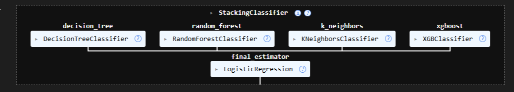
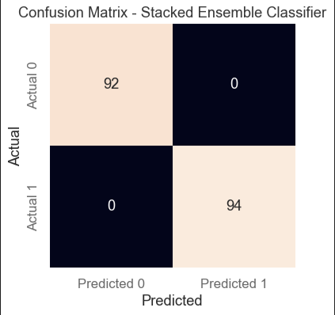
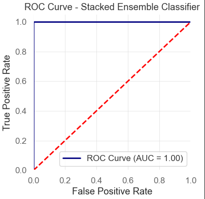
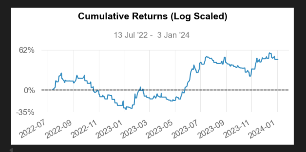
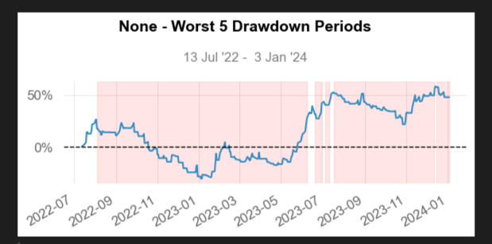

# 📈 Predicting Stock Trend using Blending Ensemble

## 🧠 Overview

This project builds a blending ensemble model to predict stock price direction (up/down classification).
The goal is to improve prediction robustness by combining multiple machine learning models instead of relying on a single estimator


---
## Contents
- <a href="#methodology">Methodology</a>
- <a href="#tools & technologies">Tools & Technologies</a>
- <a href="#pipeline">Pipeline</a>
- <a href="#evaluation metric">Evalauation Metrics</a>
- <a href="#backtesting results">Backtesting Results</a>
- <a href="#screenshots">Screenshots</a>
- <a href="#project-structure">Project Structure</a>
- <a href="#how-to-run-this-project">How to Run This Project</a>
- <a href="#key highlights">Key Highlights</a>
- <a href="#future improvements">Future Improvements</a>
- <a href="#author">Author</a>


<h2><a class="anchor" id="methodology"></a>Methodology</h2>

### 1. Data Processing

* Handling missing values
* Feature scaling using **StandardScaler**
* Train-test split for evaluation

### 2. Models Used

#### Stacked Models
* Decision Tree Classifier 
* Random Forest Classifier
* KNN Classifier 
* Gradient Boosting Classifier
#### Final Estimaor
* Logistic Regression Classifier 

### 3. Ensemble Strategy (Blending)

* Each model outputs probability predictions
* Final Estimator is Logistic Regression Classifier
* Threshold = 0.5 for classification

---

<h2><a class="anchor" id="tools & technologies"></a>Tools & Technologies</h2>

 * Python (Pandas,NumPy,scikit-learn,matplotlib,sns,statsmodels,quantstats)
 * Git
 * Github

---


<h2><a class="anchor" id="pipeline"></a>Pipeline</h2>

```
 Data → Preprocessing → Train/Test Split → Model Training → Blending → Evaluation
```

---

<h2><a class="anchor" id="evaluation metric"></a>Evaluation Metric</h2>

* Accuracy Score     -----------          99.46 %
---
<h2><a class="anchor" id="backtesting results"></a>Backtesting Results</h2>

* Cumulative Returns -----------           47.59 %
* Sharpe Ratio       -------------         0.86
* Sortino Ratio     -------------          1.28
* Win Days-          -----------------    56.63%
* Win Month      ----------------               44.44%
* Win Quarter    --------------               66.67%
* Win Year      ------------------                50.0%

---
<h2><a class="anchor" id="screenshots"></a>Screenshots</h2>

#### Stacked Classifier


#### Confusion Matrix


#### ROC Curve


#### Cumulative Returns


#### Drawdowns


---


<h2><a class="anchor" id="project-structure"></a>Project Structure</h2>

```
├── notebook.ipynb
├── src
│   ├── data.py
│   ├── eda.py
│   ├── models.py
│   ├── strategy.py
│   └── main.py
├──images
├── requirements.txt
├── .gitignore
└── README.md
```

---

<h2><a class="anchor" id="how-to-run-this-project"></a>How to run this Project</h2>

```bash
git clone (https://github.com/pranavp222/Predicting-Stock-trend-using-Blending-Ensemble-ML)
cd predicting-stock-trend-using-Blending-Ensemble-ML

pip install -r requirements.txt
python main.py
```

---

<h2><a class="anchor" id="key highlights"></a>Key Highlights</h2>

* Modular and reusable ML pipeline
* Ensemble learning implementation (blending)
* Clean separation between data, models, and evaluation
* Easily extensible for new models or features

---

<h2><a class="anchor" id="future improvements"></a>Future Improvements</h2>

* Cross-validation for robust evaluation
* Hyperparameter tuning (GridSearch / Optuna)
* Feature engineering (technical indicators like RSI, MACD)
* Backtesting with financial metrics (Sharpe Ratio, Drawdown)
* Deployment as an API or dashboard

---

<h2><a class="anchor" id="author"></a>Author</h2>

**Pranav Patil, CQF**

📧 Email: pranavp222@gmail.com

🔗 [LinkedIn](https://www.linkedin.com/in/pranav-patil-cqf-0a468182/)  


---

